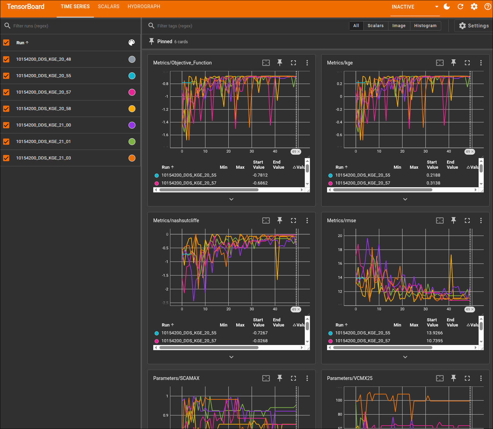
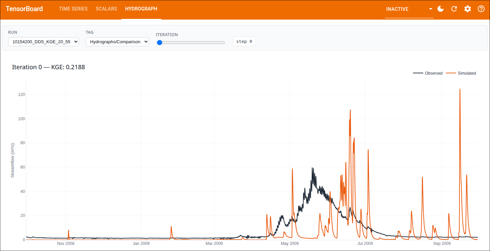

# NGIAB-Spotpy

[](https://github.com/NOAA-OWP/ngen)
[](https://ngiab.ciroh.org/)
[](https://spotpy.readthedocs.io/)

These scripts were inspired by and based on Nadia Schreiber's work for the CSM Ensembles project lead by Andy Wood. Later adapted by Ayman Nassar then further modified by the Alabama Water Institute

A script-first calibration harness for [NextGen In A Box (NGIAB)](https://ngiab.ciroh.org/) models. Built on [SpotPy](https://spotpy.readthedocs.io/), with every iteration streamed to TensorBoard — metrics, sampled parameters, and periodic hydrographs.

> 🚧 **Preview repo.** This is the development version of the tool that will be published to [CIROH-UA/NGIAB-Spotpy](https://github.com/CIROH-UA/NGIAB-Spotpy). Also the hands-on calibration component of the [2026 EWRI Technical Workshop](https://github.com/skoriche/EWRI2026_NextGen_Workshop).

## 📊 What you'll see

**Scalars** — objective value, KGE / NSE / RMSE, and each parameter's value at every iteration.



**Hydrographs** — observed vs. simulated flow, logged periodically during the run.



---

## Quick start

Pick the environment you're running in:

### ☁️ Option A — 2i2c JupyterHub

The 2i2c image ships with this repo at `/ewri_cal/`, dependencies already installed, and all three workshop gages pre-extracted under `data/` (as `EWRI26_USGS_<id>/` — `main.py` picks those up automatically when a `gage-<id>/` folder isn't present). No download step needed.

Either log into ciroh 2i2c JupyterHub or run it the command below and open http://localhost:8888 in your browser

```bash
docker run -p 8888:8888 awiciroh/ewri_cal jupyter lab --ip=0.0.0.0 --port=8888 --no-browser --allow-root --NotebookApp.to
ken='' --NotebookApp.password=''
```

Once on jupyterhub, launch a terminal and run
```bash
uv run python main.py
```

Open **TensorBoard** from the JupyterHub launcher to watch the run live (the proxy is preconfigured). Edit `gage_id`, dates, or parameter ranges at the top of `main.py` if you want to calibrate one of the other workshop gages.

### 🖥️ Option B — Local

Prerequisites: Docker and [`uv`](https://docs.astral.sh/uv/getting-started/installation/).

```bash
# 1. Clone and install (Python 3.12, managed by uv)
git clone https://github.com/JoshCu/ewri_cal && cd ewri_cal && uv sync

# 2. Get an NGIAB data folder (either option works)

#    a) Generate your own for any USGS gage:
uvx ngiab-prep -i gage-10154200 --start 2007-10-01 --end 2014-10-02 -sfr --source aorc --output_root data

#    b) Or grab a pre-built workshop tarball (Provo River, UT — matches main.py defaults):
mkdir -p data
curl -L https://ciroh-awi-ewri-data.s3.us-east-1.amazonaws.com/EWRI26_USGS_10154200.tar.gz | tar -xz -C data
# main.py accepts either data/gage-<id>/ or data/EWRI26_USGS_<id>/ — no rename needed

# 3. Run the calibration
uv run python main.py

# Tensorboard can be tricky to get working, this is what I needed install it
uv tool install -p 3.10 tensorboard==2.16.* --with setuptools==80.* --with tensorflow --with numpy==1.* --with tensorboard_plugin_hydrograph --reinstall

# 4. Watch live in a second terminal
tensorboard --logdir ~/logs
```

---

When the run finishes, the best parameter set is written to `data/gage-<id>/spotpy/best_params.csv`. TensorBoard logs stay at `~/logs/<gage>_<algo>_<obj>_<HH_MM>/` so you can compare runs side by side.

## 🔧 What to edit

Everything the user normally touches lives in `main.py`:

```python
gage_id = "10154200"
start_date          = pd.to_datetime("2007-10-01")
end_date            = pd.to_datetime("2009-09-30")
training_start_date = pd.to_datetime("2008-09-30")   # warmup ends here

CFE_PARAMS = {
    "b":      Uniform(2.0, 15.0, optguess=4.05),
    "satpsi": Uniform(0.03, 0.955, optguess=0.355),
    # ...
}
NOAH_PARAMS = { ... }
CALIBRATION_PARAMS = {"CFE": CFE_PARAMS, "NoahOWP": NOAH_PARAMS}
```

The keys of `CALIBRATION_PARAMS` must match each module's `model_type_name` in `realization.json` — that's what routes sampled values to the right model.

<details>
<summary><b>Parameter catalogs & algorithm options</b></summary>

Any [SpotPy distribution](https://spotpy.readthedocs.io/en/latest/Parameter/) works (`Uniform`, `Normal`, `Triangular`, …). Full model parameter references:

- **CFE** — [bmi_cfe.c](https://github.com/NOAA-OWP/cfe/blob/a349a953ef239ae7470a8365cf614283d7e6ca80/src/bmi_cfe.c#L2208)
- **Noah-OWP-Modular** — [bmi_noahowp.f90](https://github.com/NOAA-OWP/noah-owp-modular/blob/0abb891b48b043cc626c4e4bbd0efe54ad357fe1/bmi/bmi_noahowp.f90#L304)

Arguments accepted by `run_spotpy` in `main.py`:

| Arg | Options / meaning |
| --- | --- |
| `algorithm` | `"DDS"` or `"SCE"` |
| `objective_function` | `"KGE"` or `"RMSE"` |
| `repetitions` | iterations per DDS trial, or total SCE samples |
| `dds_trials` | DDS restarts (total evaluations ≈ `repetitions × dds_trials`) |
| `save_trials` | `True` = CSV database of every iteration; `False` = RAM, keep best only |
| `hydrograph_frequency` | log a hydrograph every N iterations (default 10) |

</details>

<details>
<summary><b>Output files</b></summary>

```
data/gage-<id>/
├── config/realization.json                      # rewritten each iteration
├── outputs/troute/*.nc                          # latest simulation output
└── spotpy/
    ├── usgs_streamflow.pkl / .csv               # cached USGS observations
    ├── best_params.csv                          # final best parameter set
    └── spotpy_db_<gage>_<algo>_<obj>.csv        # only when save_trials=True

~/logs/<gage>_<algo>_<obj>_<HH_MM>/              # TensorBoard events
```

</details>

<details>
<summary><b>EWRI 2026 workshop gages</b></summary>

All three gages are pre-extracted on the 2i2c image. For local use, download and extract into `data/`:

| Gage | USGS ID | Tarball |
| --- | --- | --- |
| Provo River near Woodland, UT | `10154200` | [EWRI26_USGS_10154200.tar.gz](https://ciroh-awi-ewri-data.s3.us-east-1.amazonaws.com/EWRI26_USGS_10154200.tar.gz) |
| Choctawhatchee River near Newton, AL | `02361000` | [EWRI26_USGS_02361000.tar.gz](https://ciroh-awi-ewri-data.s3.us-east-1.amazonaws.com/EWRI26_USGS_02361000.tar.gz) |
| Sipsey Fork near Grayson, AL | `02450250` | [EWRI26_USGS_02450250.tar.gz](https://ciroh-awi-ewri-data.s3.us-east-1.amazonaws.com/EWRI26_USGS_02450250.tar.gz) |

`main.py` looks for `data/gage-<id>/` first and falls back to `data/EWRI26_USGS_<id>/`, so no rename is required either way. Update `gage_id` in `main.py` to pick between the three.

</details>

## 🧪 Execution backends

The script auto-selects how NextGen gets run:

| Environment | Backend | How it runs |
| --- | --- | --- |
| 2i2c (`~` contains `jovyan`) | Native MPI | `mpirun -n <n> /dmod/bin/ngen-parallel …` with catchments split by `create_partitions` |
| Local (default) | Docker | `docker run awiciroh/ngiab …` |
| Opt-in | Rust (experimental) | see below |

Force-override the 2i2c detection by editing `IS_2I2C` in `calibration.py`.

<details>
<summary><b>⚠️ Experimental: Rust backend (not official NextGen)</b></summary>

**Not part of the official NextGen stack.** This backend uses community Rust reimplementations of the NextGen runtime and T-Route ([`bmi-driver`](https://github.com/joshcu/bmi-driver) and [`rs-route`](https://github.com/CIROH-UA/rs_route)). It is substantially faster than Docker on some workloads, but is still in development and its outputs may differ from the reference implementation (typically by less than 1% which stems from rs-route). Validate before using results.   
For the 02450250 example data on a 32 core machine, the rust backend is ~19x faster.

Both binaries are preinstalled on the 2i2c image. For local use:

```bash
# install rust if needed
curl https://sh.rustup.rs -sSf | bash -s
# then install 
cargo install rs-route bmi-driver
# if the bmi-driver install fails, you might have more success without python support
cargo install bmi-driver --no-default-features --features "fortran"
```

Enable by setting `USE_RUST = True` in `calibration.py`. The flag only takes effect when both binaries are detected; otherwise the script falls back to Docker (or MPI on 2i2c).

</details>

## Acknowledgments

- [CIROH](https://docs.ciroh.org/) for NextGen In A Box
- [SpotPy](https://spotpy.readthedocs.io/) for the calibration framework
